# Smart Environment Station

This project is a real-time environmental monitoring system built with the Texas Instruments EK-TM4C123GXL Tiva C LaunchPad.

The system measures temperature, humidity, and ambient light level. The measured values are shown on an SSD1306 OLED display and are also sent to a computer through UART.


## Final System

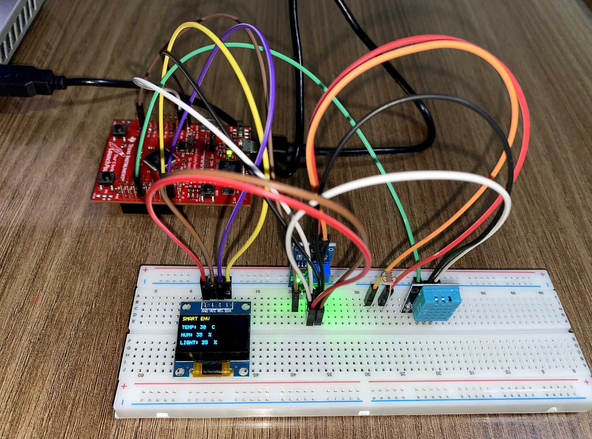

The final setup combines the EK-TM4C123GXL LaunchPad, DHT11, LDR module, SSD1306 OLED, and breadboard power distribution in a single working system.

https://github.com/user-attachments/assets/b2d0ba03-928c-42d6-9a56-f277a7e5671e


## Project Purpose

The main goal of this project was to learn how different peripherals of the TM4C123GH6PM microcontroller can work together in a complete embedded system.

The project includes:

- GPIO configuration
- UART communication
- ADC measurement
- I2C communication
- Digital sensor communication
- Sensor calibration
- Error handling
- OLED data display

## Features

- Temperature and humidity measurement with DHT11
- Ambient light measurement with an LDR module
- 12-bit ADC reading through PE3/AIN0
- 16-sample averaging for more stable light measurements
- Calibrated light percentage calculation
- SSD1306 OLED communication through I2C
- UART monitoring through the Stellaris Virtual Serial Port
- DHT11 checksum and timeout control
- Live sensor updates approximately every two seconds

## Hardware Components

- EK-TM4C123GXL Tiva C LaunchPad
- TM4C123GH6PM microcontroller
- DHT11 temperature and humidity sensor module
- LDR sensor
- LM393-based LDR module
- 0.96-inch I2C OLED display
- Breadboard
- Jumper wires
- Micro-USB cable

## Pin Connections

| Module | Module Pin | Tiva C Pin |
|---|---|---|
| DHT11 | S | PD0 |
| DHT11 | + | 3.3 V |
| DHT11 | - | GND |
| LDR module | AO | PE3 / AIN0 |
| LDR module | VCC | 3.3 V |
| LDR module | GND | GND |
| OLED | SCL | PB2 / I2C0SCL |
| OLED | SDA | PB3 / I2C0SDA |
| OLED | VCC | 3.3 V |
| OLED | GND | GND |
| UART0 | RX | PA0 |
| UART0 | TX | PA1 |

The LDR module's digital output (`DO`) is not used. Its analog output (`AO`) is connected to PE3/AIN0.

## Power Distribution

The LDR module, DHT11, and OLED share the same 3.3 V and GND lines through the breadboard.

```text
Tiva 3.3 V
├── LDR VCC
├── DHT11 +
└── OLED VCC

Tiva GND
├── LDR GND
├── DHT11 -
└── OLED GND
```

The 5 V pin is not used.


### Setup Details

| Power distribution | Sensor connections | I2C connections |
|---|---|---|
| 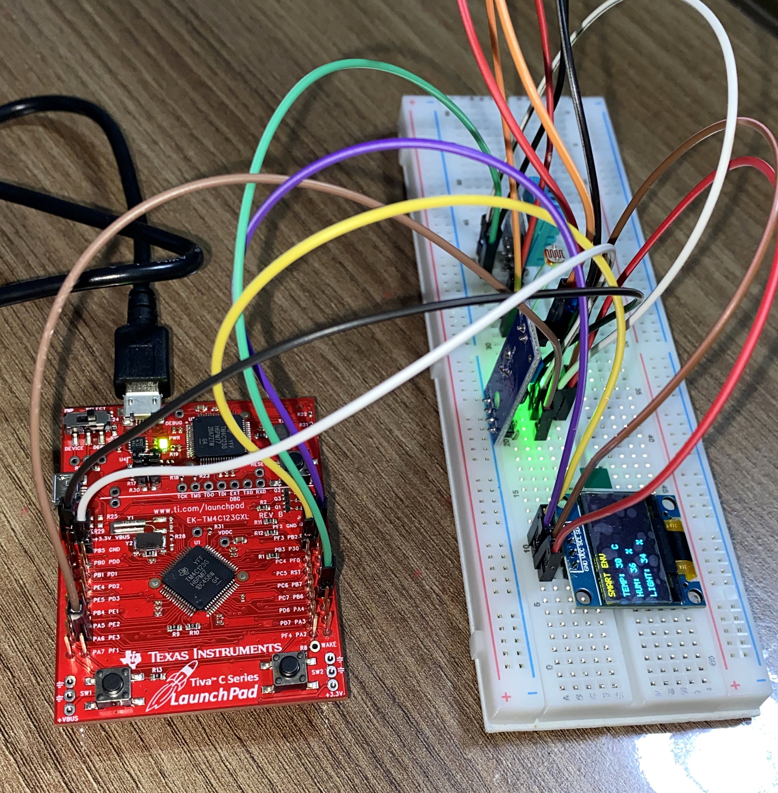 | 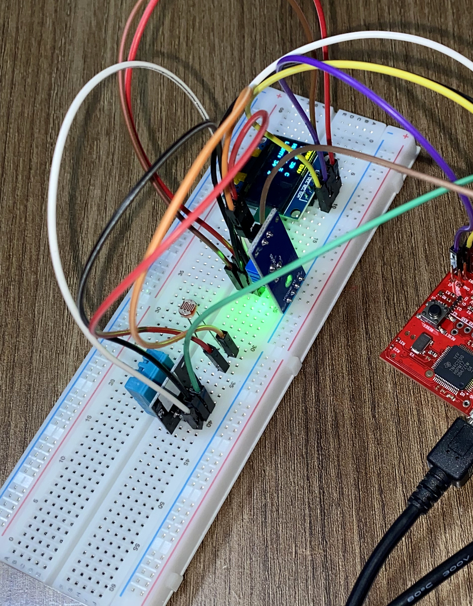 | 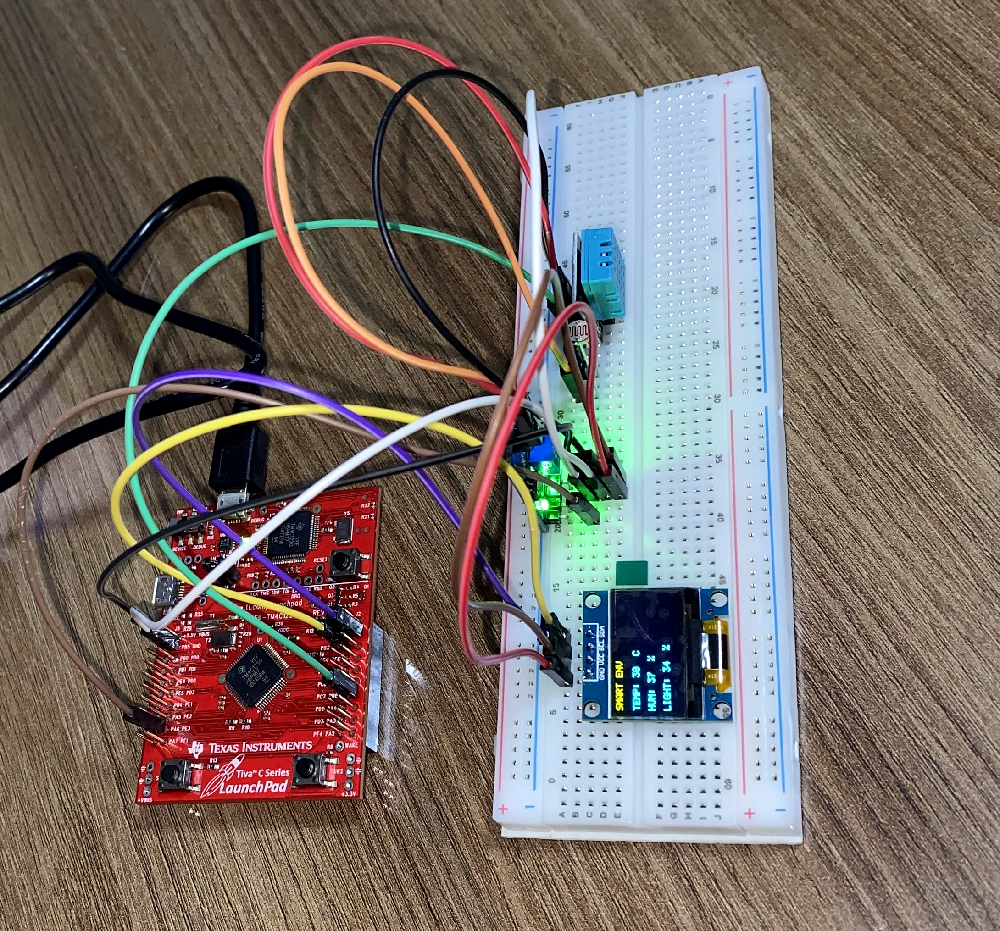 |


## Software Requirements

- Code Composer Studio
- TivaWare for C Series 2.2.0.295
- TI ARM Compiler 20.2.7.LTS
- PuTTY or another serial terminal application
- Stellaris ICDI drivers

## UART Configuration

```text
Port: Stellaris Virtual Serial Port
Baud rate: 115200
Data bits: 8
Parity: None
Stop bits: 1
Flow control: None
```

This configuration is commonly written as `115200 8N1`.

The COM port number may be different on another computer. It can be checked in Windows Device Manager under `Ports (COM & LPT)`.

## LDR Measurement

The analog output of the LDR module is connected to PE3/AIN0.

The TM4C123GH6PM ADC has 12-bit resolution, so the raw ADC value is between 0 and 4095.

To reduce small fluctuations, the program reads 16 ADC samples and calculates their average.

The sensor was calibrated using these measured limits:

```c
#define LDR_RAW_BRIGHT 175U
#define LDR_RAW_DARK   3504U
```

The module produces a lower ADC value under strong light and a higher ADC value in darkness.

After calibration:

```text
Strong light -> approximately 100%
Darkness     -> approximately 0%
```

## DHT11 Communication

The DHT11 data line is connected to PD0.

The microcontroller starts communication by holding the data line LOW for approximately 20 milliseconds. The sensor then sends 40 bits:

- Humidity integer byte
- Humidity decimal byte
- Temperature integer byte
- Temperature decimal byte
- Checksum byte

Each data bit is identified by checking the signal level approximately 40 microseconds after the HIGH pulse begins.

The checksum byte is used to verify the received data. Possible errors are:

```text
Response timeout
Data timeout
Checksum error
```

### DHT11 Hardware Views

| Sensor overview | Pin view | Connection detail |
|---|---|---|
| 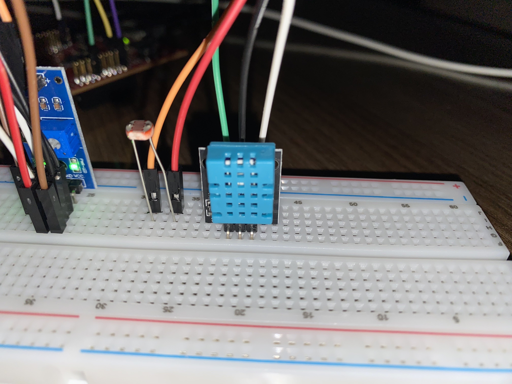 | 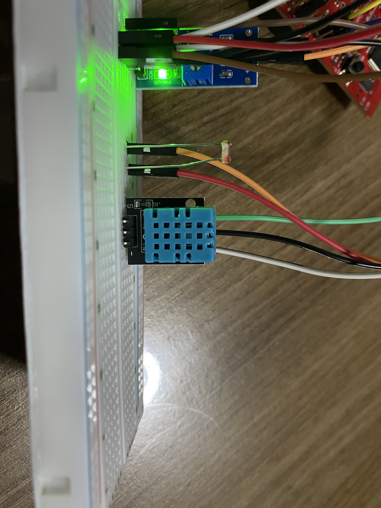 | 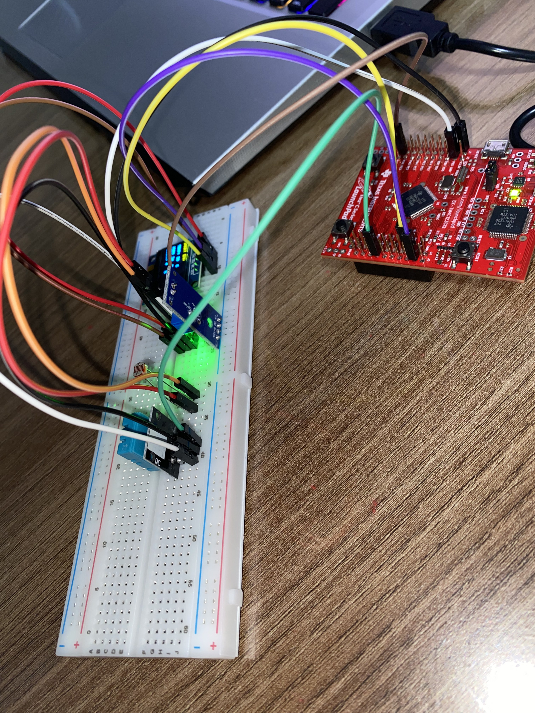 |

## OLED Communication

The OLED uses the I2C0 peripheral:

```text
PB2 -> SCL
PB3 -> SDA
```

The detected I2C address is `0x3C`.

The program first checks whether the OLED responds at this address. It then sends the SSD1306 initialization commands and clears the display memory.

A small 5x7 font is used to display text and numerical values.

## OLED Output

```text
SMART ENV
TEMP: 30 C
HUM: 37 %
LIGHT: 42 %
```

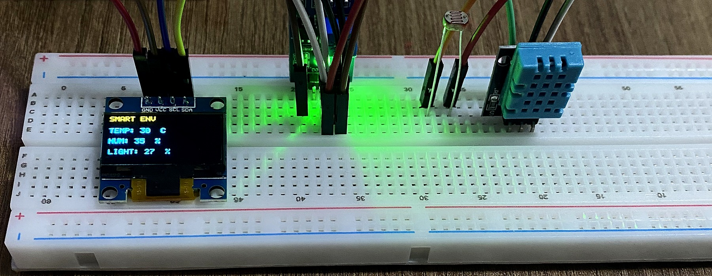

The values are updated approximately every two seconds.

If the DHT11 reading fails, the OLED displays:

```text
DHT ERROR
```

## UART Output

The same measurements are also sent to the computer through UART.

Example:

```text
Temperature: 30 C | Humidity: 37 % | Light: 42 % | LDR Raw: 2100
```

UART was kept active during development because it made sensor, ADC, I2C, and timing problems easier to diagnose.

## Development Notes

### GPIO Test

The TivaWare blinky example was first used to verify the board, compiler, debugger, and GPIO configuration. The RGB LED color and blinking speed were then changed.

| Green LED test | Red LED test |
|---|---|
| 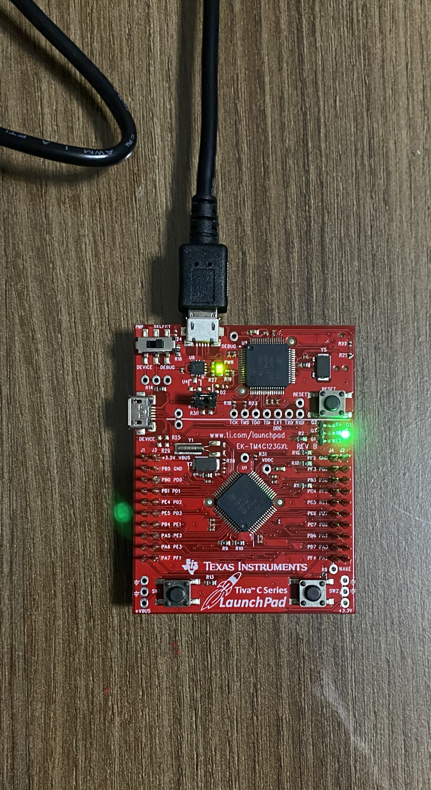 | 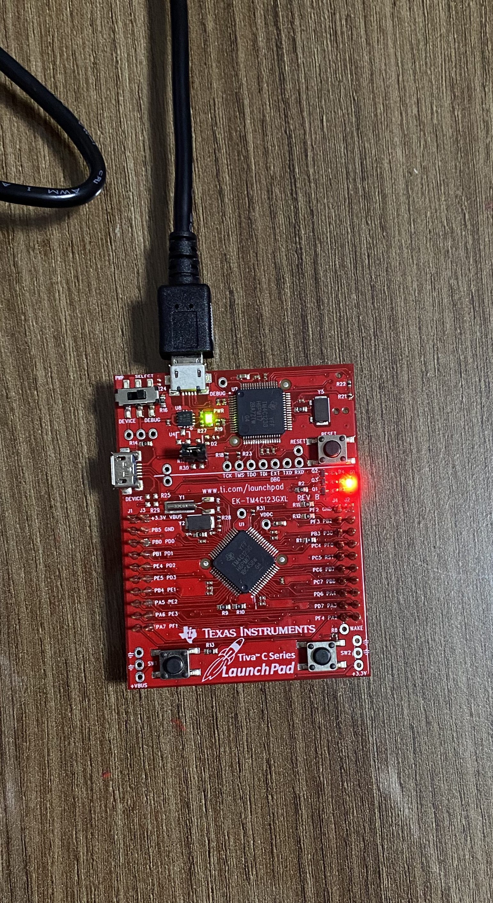 |

### UART Test

UART0 was configured using PA0 and PA1. The first test sent a fixed text message. A counter was later added to confirm that numerical values could also be transmitted.

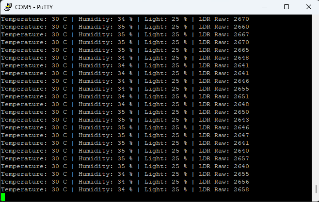

### LDR and ADC Test

The LDR analog output was read from PE3/AIN0.

At one stage, the module's `DO` pin was mistakenly connected to PE3 instead of `AO`. This caused the ADC value to remain close to 4095.

The connection was corrected as follows:

```text
LDR AO -> PE3 / AIN0
LDR DO -> not connected
```

The calibrated response was checked at both ends of the measured range:

| Dark condition | Strong light |
|---|---|
| 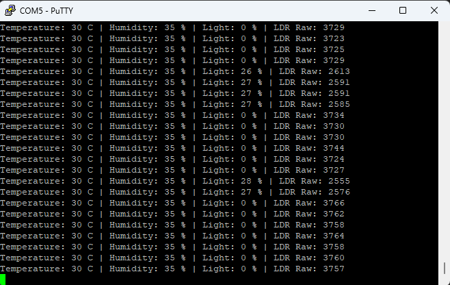 | 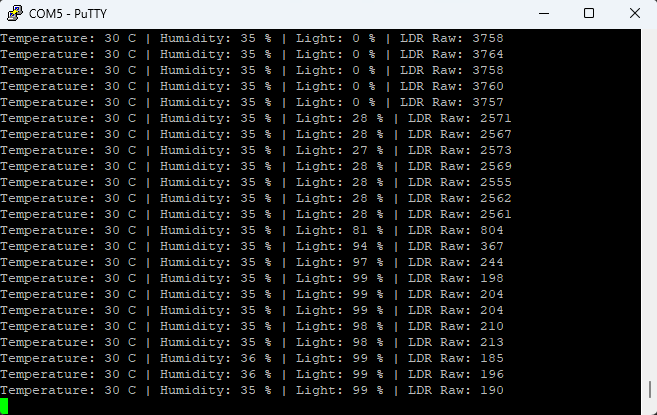 |

https://github.com/user-attachments/assets/e723f001-3617-4cf7-8d4b-557b3792fb4c

### DHT11 Timing Test

The first DHT11 implementation returned:

```text
Temperature: 0 C
Humidity: 0 %
```

All received bytes were zero, so the checksum also passed as zero.

The bit-reading method was changed. Instead of measuring the full HIGH pulse with a software counter, the data line was sampled approximately 40 microseconds after the HIGH pulse began. Valid temperature and humidity values were received after this change.

### OLED Pin Conflict

The DHT11 was initially connected to PB2. PB2 and PB3 were later needed for I2C0 communication with the OLED, so the DHT11 data line was moved to PD0.

```text
DHT11 S  -> PD0
OLED SCL -> PB2
OLED SDA -> PB3
```

### OLED Linker Error

During OLED integration, linker errors were reported for functions such as:

```text
OLED_Init
OLED_Fill
OLED_SendCommand
OLED_SendData
```

Some helper functions were called but had not yet been defined. The OLED functions were reorganized in dependency order:

```text
I2C0_Init
I2C_DeviceResponds
OLED_I2CWriteByte
OLED_SendCommand
OLED_SendData
OLED_Init
OLED_SelectFullScreen
OLED_Fill
OLED text functions
main
```

After the missing helper functions were added, the project built successfully.

## Repository Structure

```text
Smart-Environment-Station/
├── firmware/
│   └── environment_test/
├── source/
│   └── main.c
├── docs/
│   ├── development-log.md
│   ├── hardware-connections.md
│   ├── project-report.md
│   ├── test-results.md
│   ├── troubleshooting.md
│   └── user-manual.md
├── images/
│   ├── dht11/
│   ├── final-system/
│   ├── gpio/
│   ├── ldr/
│   ├── oled/
│   ├── setup/
│   └── uart/
├── CHANGELOG.md
├── LICENSE
└── README.md
```

- `firmware`: Complete Code Composer Studio project
- `source`: Main source code for quick review
- `docs`: Project documentation and test records
- `images`: Hardware photos, screenshots, and demo videos

## Documentation

- [Project report](docs/project-report.md)
- [Final project report (PDF)](docs/report/Smart-Environment-Station-Project-Report.pdf)
- [Final project report (Word)](docs/report/Smart-Environment-Station-Project-Report.docx)
- [User manual](docs/user-manual.md)
- [Hardware connections](docs/hardware-connections.md)
- [Development log](docs/development-log.md)
- [Troubleshooting](docs/troubleshooting.md)
- [Test results](docs/test-results.md)
- [Changelog](CHANGELOG.md)

## Build Instructions

1. Install Code Composer Studio.
2. Install TivaWare for C Series 2.2.0.295.
3. Install TI ARM Compiler 20.2.7.LTS.
4. Import the project from `firmware/environment_test`.
5. Select the **Debug** build configuration. This is the configuration used for the final tested version.
6. Check the TivaWare include path.
7. Check that `driverlib.lib` is included in the linker settings.
8. Make sure only one startup file is included in the build.
9. Clean and build the project.
10. Connect the EK-TM4C123GXL through the DEBUG USB port.
11. Start the debug session.
12. Open PuTTY with the UART settings listed above.

## Test Results

| Test | Result |
|---|---|
| GPIO LED blinking | Passed |
| UART fixed text transmission | Passed |
| UART counter transmission | Passed |
| LDR raw ADC reading | Passed |
| LDR averaging | Passed |
| LDR calibration | Passed |
| DHT11 temperature reading | Passed |
| DHT11 humidity reading | Passed |
| DHT11 checksum control | Passed |
| OLED I2C address detection | Passed |
| OLED initialization | Passed |
| OLED fill and clear test | Passed |
| Live OLED sensor display | Passed |
| Simultaneous UART and OLED output | Passed |

## Known Limitations

- The DHT11 has limited accuracy and update speed.
- The light percentage depends on calibration values measured in the current setup.
- Different LDR modules may require different calibration limits.
- The OLED font contains only the characters required by the current interface.
- The current program uses blocking delays.
- Historical measurements are not stored.

## Possible Improvements

- Replace DHT11 with DHT22 or a higher-accuracy sensor
- Use hardware timers instead of blocking delays
- Split the source code into separate driver files
- Add warning thresholds
- Add data logging
- Add Bluetooth or Wi-Fi communication
- Add a real-time clock
- Add button-controlled menus
- Design a PCB
- Add low-power operating modes

## Project Status

The current version works with the complete breadboard setup.

The system measures temperature, humidity, and ambient light level. The results are shown on the OLED display and transmitted through UART at the same time.

### Final Hardware Views

| Top view | Angled view |
|---|---|
| 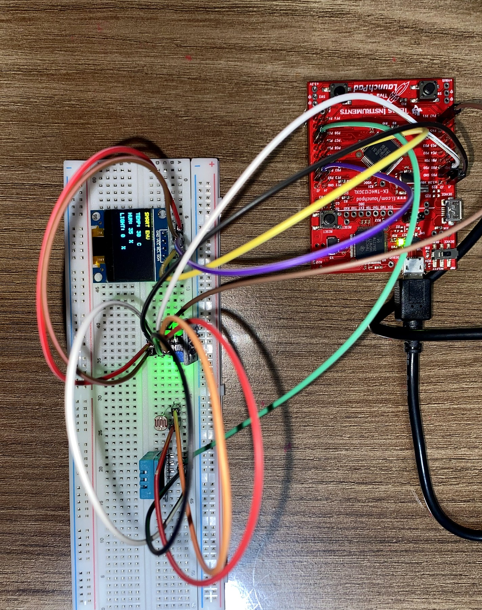 | 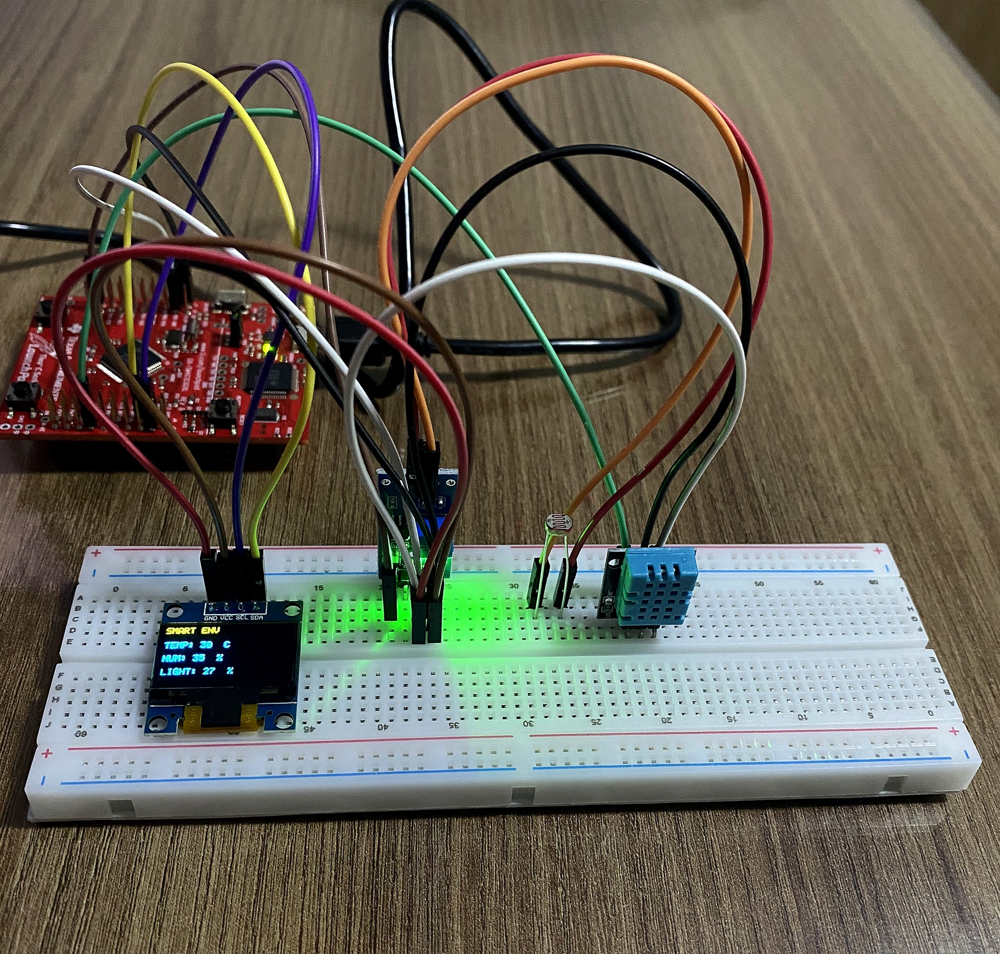 |

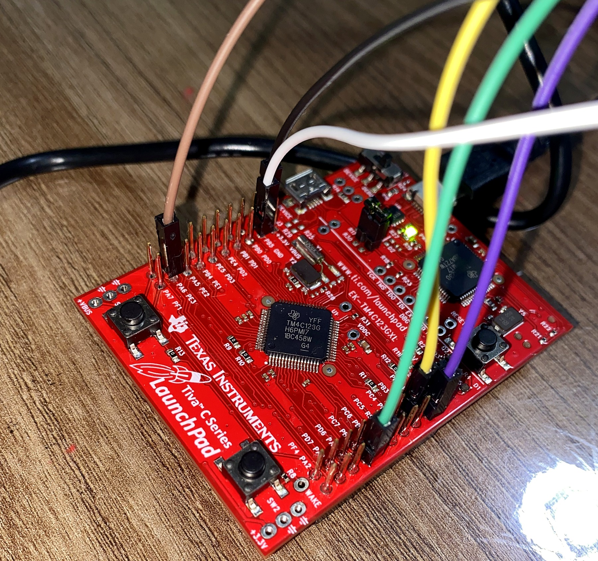
## License

The original project source code and documentation are released under the [MIT License](LICENSE). Files derived from Texas Instruments TivaWare keep their original Texas Instruments license notices and terms. See [THIRD_PARTY_NOTICES.md](THIRD_PARTY_NOTICES.md).

